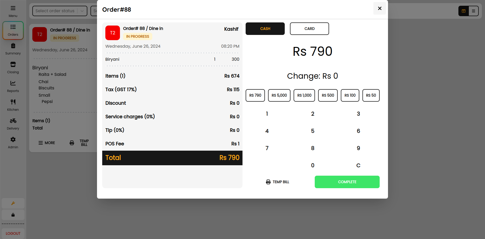
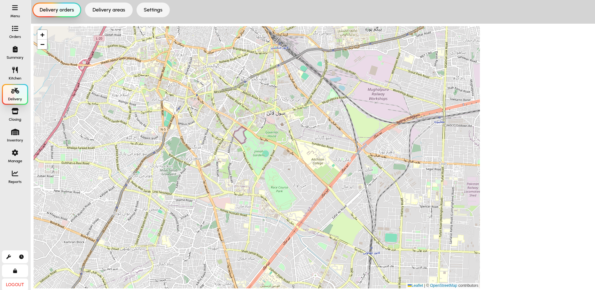

# 🍽️ Restaurant POS System
### ⚡ Fast • Multi-Branch • Full Restaurant Operations Platform

A complete **restaurant management ecosystem** built for real-world cafés, restaurants, and food chains.

Designed to handle everything from **ordering → kitchen → delivery → staff → reporting → inventory** in one unified system.

---

## 🚀 Live Demo

👉 **Try it here:** [Demo](https://ahmedali5530.xyz/posr.html)  
🔑 Login: `1234, 0000`

---

## 💥 Why This Project?

Most restaurant systems are:
- ❌ Fragmented (POS, delivery, HR all separate)
- ❌ Not built for real-time restaurant pressure
- ❌ Weak staff workflow management
- ❌ Hard to scale across branches
- ❌ No proper authentication or protected modules

This system solves that by combining everything into one platform:

- ⚡ Real-time restaurant operations
- 🍽️ Full kitchen + order lifecycle
- 🚚 Built-in delivery workflow
- 👨‍💼 Staff + manager + admin roles
- 🔐 Secure protected modules
- 📊 Full reporting & analytics layer
- 🏪 Multi-branch scalable system
- ☁️ Realtime Sync to cloud
- 💾 Automatic backups

---

## ✨ Core Modules

### 🍽️ POS & Order Management
- Table-based ordering system
- Fast item selection & modifiers
- Split / merge / cancel / transfer orders
- Real-time cart updates
- Instant billing flow

---

### 👨‍🍳 Kitchen Display System (KDS)
- Live incoming orders
- Status tracking:
    - Received
    - Preparing
    - Ready
    - Served
- Reduced communication delays between staff & kitchen

---

### 🚚 Delivery Management App
- Realtime updates to customer
- Delivery order assignment
- Driver status tracking
- Order dispatch flow
- Delivery completion updates
- Separate delivery workflow from dine-in

---

### 📱 Order Taking App (Waiter App)
- Mobile-first order entry
- Table selection & quick ordering
- Instant sync with kitchen
- Lightweight POS mode for staff devices
- Full touch compatible modules for faster order processing

---

### 👨‍💼 Manager App (Admin Control Center)
- Real-time business dashboard
- Sales & performance analytics
- Staff performance tracking
- Branch-level reporting
- System configuration

---

### 🧑‍💼 Staff Management & Shifts
- Shift creation & scheduling
- Clock-in / clock-out tracking
- Work hour monitoring
- Staff assignment per branch

---

### 🔐 Protected Modules & Role System
- Role-based access control:
    - Admin
    - Manager
    - Waiter
    - Kitchen Staff
    - Delivery Staff
    - ... and Custom roles
- Protected routes & permissions per module
- Secure operational separation

---

### 💰 Tips Distribution System
- Track collected tips
- Automatic tip pooling
- Staff-based distribution rules
- Shift-based tip allocation

---

### ⏱️ Time Tracking System
- Employee working hours tracking
- Shift duration monitoring
- Late/early detection
- Attendance history logs

---

### 📦 Inventory Integration
- Stock-aware menu system
- Auto stock deduction on orders
- Low stock alerts
- Category-based product structure

---

## ⚡ Speed-Focused UX

Built for real restaurant pressure situations:
- Minimal clicks ordering
- Touch-screen-friendly workflow
- Quick table switching
- Optimized for peak-hour usage

---

## 🏗️ Tech Stack

- ⚛️ React.js (Frontend)
- 🗄️ SurrealDB
- 🌐  Websockets Architecture
- 🗄️ Realtime Database-driven inventory & orders

---

## 📸 Screenshots





---

## 🔥 Key Highlights

- Built specifically for **restaurant workflows**
- Handles **real-time order lifecycle**
- Designed for **high-pressure environments**
- Supports **multi-table restaurant operations**
- Scalable for **small cafés → multi-branch restaurants**
- **Delivery apps**
- **Order taking apps**
- Manager apps for **authentication and reporting**
---

## ⚡ Quick Start with Docker

```bash
git clone https://github.com/ahmedali5530/restaurant-pos
cd restaurant-pos
bun install
docker compose up -d
```
---

## 🧭 Roadmap
- Offline mode support
- Advanced analytics dashboard
- AI-based demand forecasting
- Multi-branch synchronization improvements
- Payroll system integration
- Account module integration

---

## 🤝 Contributing

Want to improve this system?

Fork the repo 🍴
Create a feature branch 🌿
Submit a PR 🚀

---

## ⭐ Support

If this project helps you, please consider giving it a ⭐ on GitHub.

It helps increase visibility and motivates continued development.