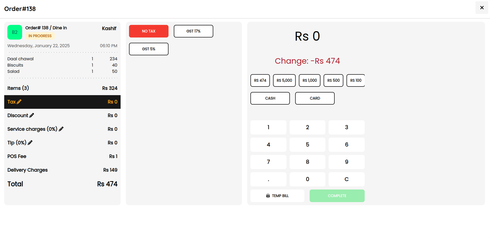

# Point of sale system for Restaurants

This system is still in development

This is a point of sale system designed for restaurants.
This is built with **React + TypeScript + TailwindCSS + SurrealDB**

### Features
- Flexible Floor layout
- Multiple orders on same table
- Multiple seats on same table
- Modifiers
- Kitchen module
- Delivery module
- Integrated Admin panel

### Screenshots

